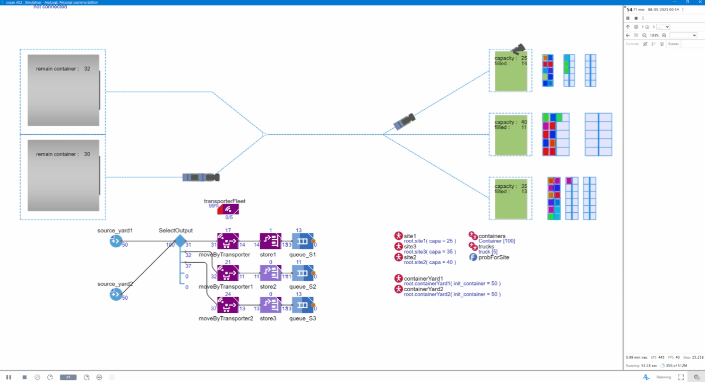

#  Port Container Evacuation & Transport Simulation-AnyLogic

##  Project Overview

This project develops a high-fidelity simulation system for port container transportation and emergency evacuation using AnyLogic.

The model captures the full operational process, including container handling, yard storage, and internal transport, to evaluate system performance and identify system bottlenecks under large-scale scenarios.

---

##  Demo

---

##  Simulation Preview

### System Modeling (Process Flow)

### 3D Simulation Environment

---

##  Problem Definition

In large-scale port operations, especially under emergency conditions, all containers must be evacuated within a limited time window.

Key challenges include:

- High container volume (~35,000 TEU)
- Limited transport capacity (trucks, cranes)
- Complex yard structure and road network
- Strong coupling between handling equipment and transport system

---

## ⚙️ System Modeling

The simulation is built using **AnyLogic**, a multi-method simulation platform supporting discrete-event and agent-based modeling.

### Key Components

- **Yard System**  
  Block–Bay–Row–Tier structure for container storage

- **Transport Network**  
  Road topology with routing and congestion constraints

- **Resources**  
  - Container trucks  
  - Yard cranes  
  - Handling equipment  

- **Constraints**  
  - Speed limits in different zones  
  - Vehicle turning radius  
  - Yard capacity limits  
  - Resource availability  

---

##  Simulation Logic

The system simulates the full workflow:

1. Container generation / unloading  
2. Storage allocation in yard  
3. Transport assignment  
4. Vehicle routing through network  
5. Delivery to evacuation zones  

The model integrates queueing, routing, and resource scheduling mechanisms.

---

##  Strategies

Two scheduling strategies are implemented:

- **Dynamic Resource Allocation**  
- **Priority-based Dispatching**

---

##  Results & Insights

- Total evacuation time ranges from **15 to 31.7 days**
- Transport fleet size is the dominant factor affecting system performance
- Increasing transport resources significantly reduces completion time
- Diminishing returns appear beyond a certain threshold
- Bottlenecks mainly occur at **yard-to-road transition areas**

---

##  Modeling Highlights

- Transport scheduling with resource constraints  
- Dynamic routing under congestion conditions  
- Coupled crane–vehicle operations  
- Simulation-based bottleneck identification  

---

##  Note

Due to confidentiality considerations, the full AnyLogic model file and dataset are not publicly available.

However, system design, simulation previews, and results are provided to demonstrate the modeling and analysis process.

---

##  Keywords

Supply Chain | Port Logistics | Simulation | AnyLogic | Scheduling | Transportation | Operations Research
